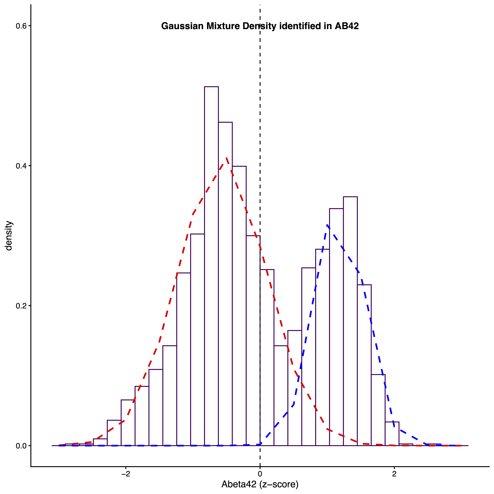
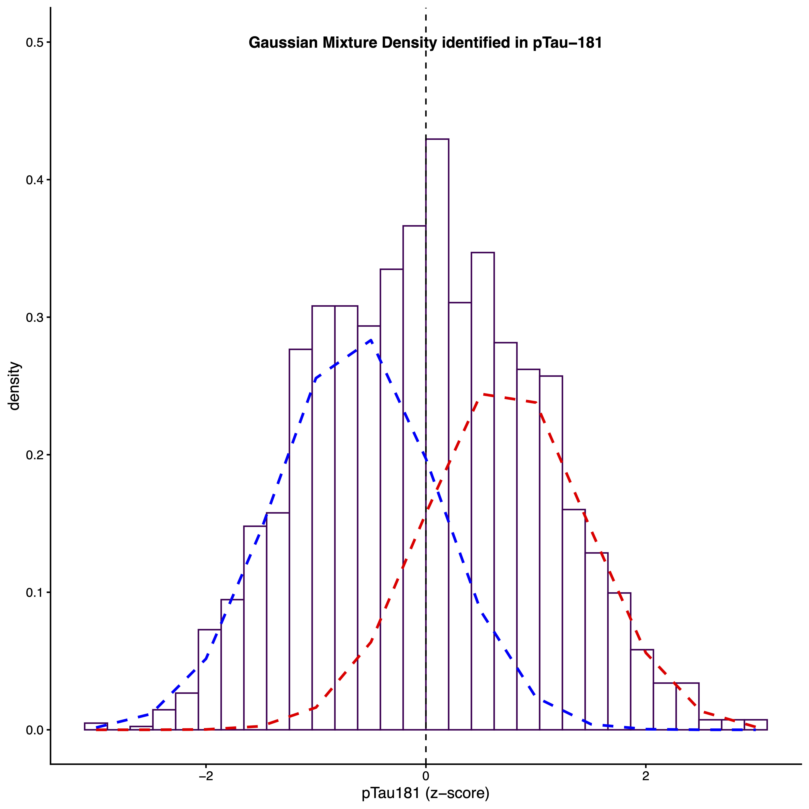
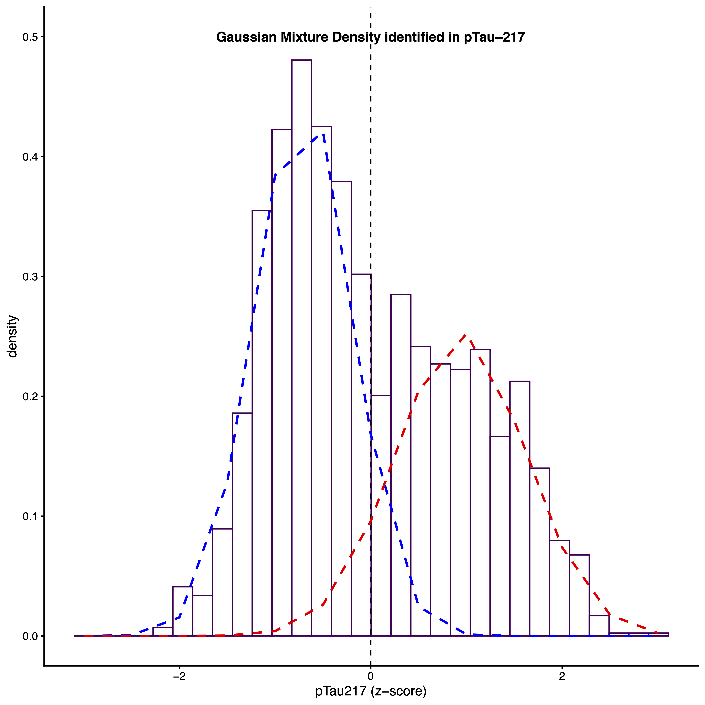
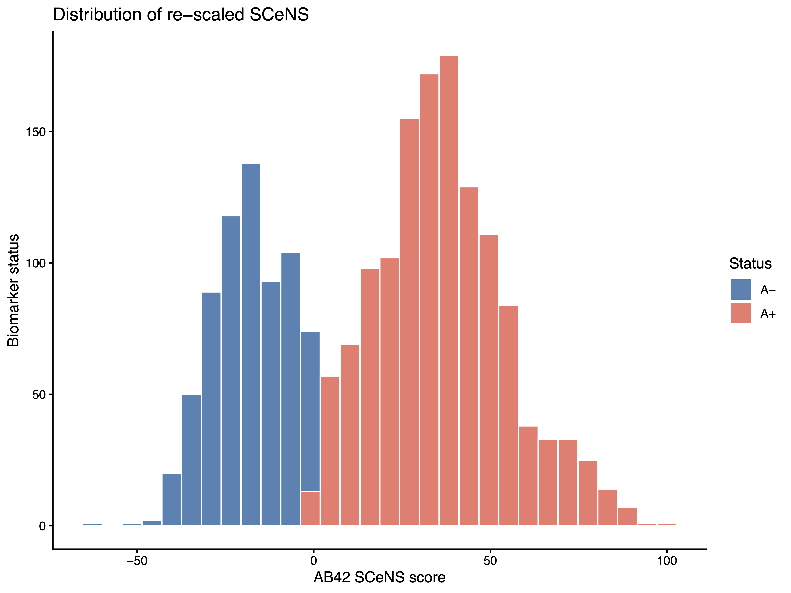
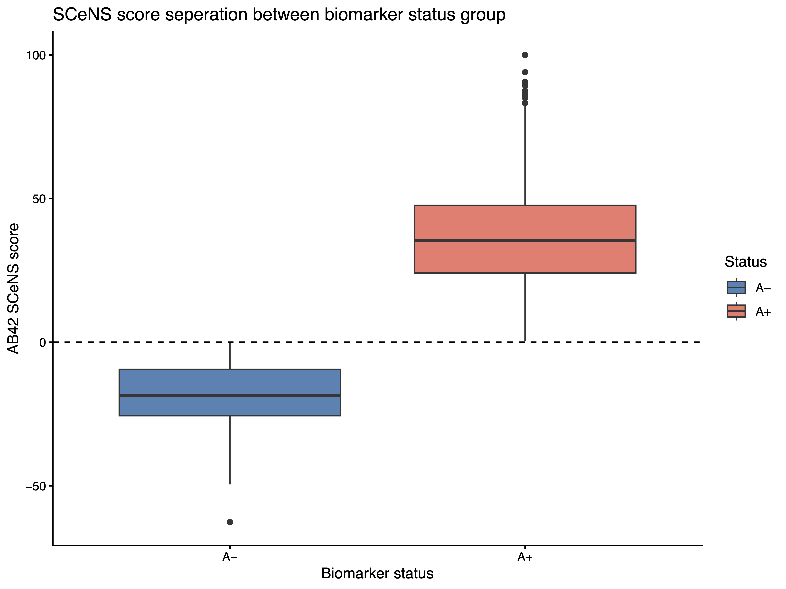
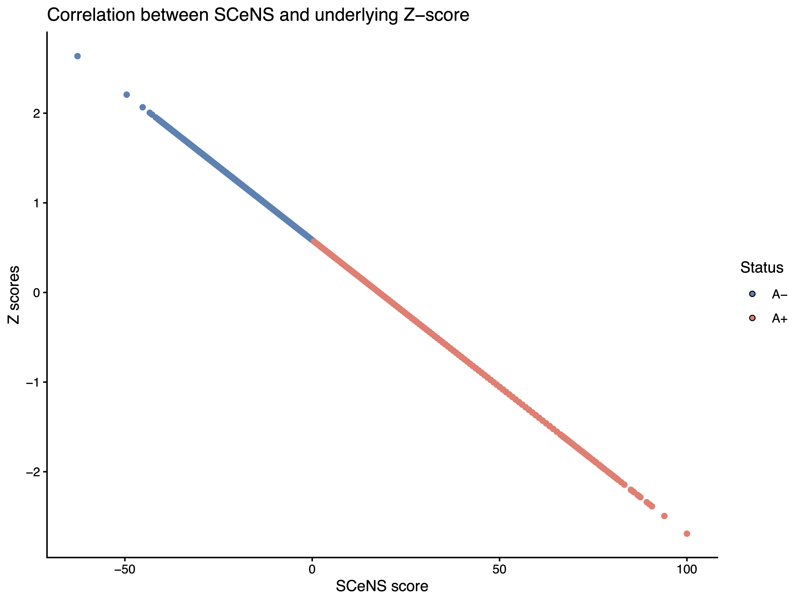

## Citation

If you use these codes for your project, please cite:

[Timsina, J., et al. Harmonization of CSF and imaging biomarkers in Alzheimer's disease: Need and practical applications for genetics studies and preclinical classification. *Neurobiology of Disease*, 2024.](https://doi.org/10.1016/j.nbd.2023.106373)

For the SCeNS standardization framework, please also cite:

Timsina, J., et al. Symmetric Centipolar Normalized Score (SCeNS): a standardization framework for fluid marker cross-comparability in Alzheimer's disease. *Under revision*, 2026.

## Overview

This tutorial provides step-by-step instructions for performing proteomic fluid biomarker quality control, generating biomarker cut-off values, and calculating Symmetric Centipolar Normalized Scores using the provided dataset. 

## Getting Started 
### Prerequisites

**Environment:** R Studio

**Packages:** Please install and load the following packages

- `data.table`
- `dplyr`
- `readxl` (if data is provided in an excel sheet)
- `stringi` / `stringr`
- `tidyr`
- `mclust`

**Input**: Data frame or data table with samples as rows and biomarker as column

## Step 1: Quality control

This step identifies and removes outliers from your biomarker data using the **Interquartile Range (IQR)** method. The `QC_function` processes one biomarker at a time, checking for any missing values, flagging values that fall outside the expected range. A log transformation can optionally be applied prior to outlier detection to normalize skewed distributions. The script uses log10 base. This can be turned off if your data is already in log scale (e.g., Olink NPX or Alamar NPQ values).

Download the **step1_IQR_based_outlier_detection.R** from the repository and save it to your working directory. 

**Caution:** Missing data in the matrix must be denoted with `NA` as numerical annotation like 0, -1, -9 will be processed as valid proteomic reading.

**Source the script:**

```r
source("step1_IQR_based_outlier_detection.R")
```

**Read in the example dataset provided**

```r
Input_file <- fread("Sample_Data_matrix.csv")
```

**Function Parameters:**

| Parameter   | Description                                                                                                                                                         | Example                             |
| ----------- | ------------------------------------------------------------------------------------------------------------------------------------------------------------------- | ----------------------------------- |
| `dat`       | Your input data frame                                                                                                                                               | `Input_file`                        |
| `x`         | Biomarker column to QC (one at a time)                                                                                                                              | `"Abeta42"`,`"pTau217"`,`"pTau181"` |
| `cols_keep` | Columns to retain in output. The biomarker column specified in `x` is always kept regardless. Include your unique identifier here if merging multiple markers later | `c("SampleID", "Status")`           |
| `apply_log` | Apply log transformation before QC. Set `TRUE` for raw values, `FALSE` if data is already log-scaled (e.g., Olink NPX, Alamar NPQ)                                  | `TRUE` / `FALSE`                    |

**Call the function:**

```r
Abeta42_check <- QC_function(
  dat       = Input_file,               # input data frame
  x         = "Abeta42",               # biomarker column to QC
  cols_keep = c("SampleID", "Status"), # columns to keep
  apply_log = TRUE                     # FALSE if already log-scaled
)
```

**Recall the function for each biomarker**

```r
pTau217_check <- QC_function(
  dat       = Input_file,               
  x         = "pTau217",               
  cols_keep = c("SampleID", "Status"),
  apply_log = TRUE                    
)

pTau181_check <- QC_function(
  dat       = Input_file,              
  x         = "pTau181",              
  cols_keep = c("SampleID", "Status"), 
  apply_log = TRUE                   
)
```


**Output:**

The function returns a cleaned data frame with the following columns:

| Column               | Description                                                                            | Present when               |
| -------------------- | -------------------------------------------------------------------------------------- | -------------------------- |
| `SampleID`, `Status` | Columns specified in `cols_keep`                                                       | Always                     |
| `[biomarker]`        | Original biomarker values with outliers replaced by `NA`                               | Always                     |
| `[biomarker]_log10`  | Log10-transformed biomarker values                                                     | Only if `apply_log = TRUE` |
| `[biomarker]_zscore` | Z-score calculated from the log10 values or the biomarker column if `apply_log = TRUE` | Always                     |

## Step 2: Biomarker cut-off calculation

This step fits a Gaussian Mixture Model (GMM) to the QC-cleaned biomarker data to identify the optimal cut-off value that separates biomarker-positive from biomarker-negative samples. The model works on the z-score values generated in Step 1 and returns both a labeled dataset and a diagnostic plot.

**Source the script:**

```r
source("step2_GMM_based_biomarker_cutoff.R")
```


**Function Parameters:**

| Parameter    | Description                                                            | Example            |
| ------------ | ---------------------------------------------------------------------- | ------------------ |
| `dat`        | QCed data from `QC_check` function                                     | `Input_file`       |
| `raw_col`    | Biomarker column containing raw values                                 | `"Abeta42"`        |
| `zscore_col` | Column containing Biomarker Z-scores calculates by `QC_check` function | `"Abeta42_zscore"` |

**Call the function**

Aβ42 levels in fluid samples behave in the opposite direction compared to p-Tau species. In normal conditions, Aβ42 levels are higher, whereas in disease states it is lower. This is reverse of what is observed for p-Tau species. For this reason, Aβ42 and p-Tau dichotomization is handled by dedicated function for each.

```r
Get_ABeta_cutoff <- perform_AB_Dichotomization( x = Abeta42_check, raw_col = "Abeta42", 
zscore_col = "Abeta42_Zscore" )

Get_ptau217_cutoff <- perform_pTau_Dichotomization( x = ptau217_check, raw_col = "ptau217", 
zscore_col = "ptau217_Zscore" )

Get_ptau181_cutoff <- perform_pTau_Dichotomization( x = ptau181_check, raw_col = "ptau181", 
zscore_col = "ptau181_Zscore" )
```

**Output:**

The function returns list containing these thress objects: 

| Object        | Description                                                                                                                    |
| ------------- | ------------------------------------------------------------------------------------------------------------------------------ |
| Data frame    | Original data with a new biomarker status label column added.  Amyloid status denoted by A+/- and pTau status denoted by T+/-. |
| Plot          | Distribution plot showing the identified Gaussian components and cut-off                                                       |
| Cut-off value | The z-score threshold used for dichotomization (also printed to console)                                                       |

Access each object as
```r
Get_ABeta_cutoff_dataframe<- Get_ABeta_cutoff[[1]]
Get_ABeta_cutoff_plot<- Get_ABeta_cutoff[[2]]
Abeta_cutoff<- Get_ABeta_cutoff[[3]] 


Get_ptau217_cutoff_dataframe<- Get_ptau217_cutoff[[1]]
Get_ptau217_cutoff_plot<-Get_ptau217_cutoff[[2]]
pTau217_cutoff<- Get_ptau217_cutoff[[3]]


Get_ptau181_cutoff_dataframe<- Get_ptau181_cutoff[[1]]
Get_ptau181_cutoff_plot<- Get_ptau181_cutoff[[2]]
pTau181_cutoff<- Get_ptau181_cutoff[[3]]
```

Plots stored under Get`"[biomarker]"`cutoff_plot: 

*Note* : Plot label added post label generation







## Step 3: Symmetric Centipolar Normalized Score

Symmetric Centipolar Normalized Score (SCeNS) is an additional layer of re-scaling approach that uses the biomarker z-scores calculated using QC_function and the z-score cutoff identified by GMM. The end product of this is a dimensionless matrix where 0 is the threshold of biomarker abnormality, with the direction of values denoting the biomarker status of a sample and magnitude representing extreme from pathological threshold. This holds true across all biomarkers thereby facilitating ease of comparison across them regardless of platform, tissue or marker.

**Source the script:**

```r
source("step3_SCeNS_calculation.R")
```

Because of directionality discordance between Aβ42 and pTau species,  seperate function is designed for each.

**Function Parameters:**

| Parameter       | Description                                                                                                                                                                     | Example                      |
| --------------- | ------------------------------------------------------------------------------------------------------------------------------------------------------------------------------- | ---------------------------- |
| `dat`           | Output with z-scores from first object after perform_`[biomarker]`_Dichotomization                                                                                              | `Get_ABeta_cutoff_dataframe` |
| `column_to_use` | Column containing Biomarker Z-scores. SCeNS is calculated using this column.                                                                                                    | `"Abeta42_zscore"`           |
| `cutoff`        | Z-score biomarker cutoff identified by GMM. Stored as third object in perform_`[biomarker]`_Dichotomization call. Please make sure that it is in same scale as `column_to_use`  | `"Abeta_cutoff"`             |

**Call the function**

```r
AB42_SCeNS_calculation<- AB42_recalib(data=Get_ABeta_cutoff_dataframe,
column_to_use= "Abeta42_Zscore",
cutoff=Abeta_cutoff) ##stored above from GMM run


pTau_SCeNS_calculation<- pTau_recalib(data=Get_ptau181_cutoff_dataframe,
column_to_use= "pTau181_Zscore",
cutoff=pTau181_cutoff) ##stored above from GMM run

pTau217_SCeNS_calculation<- pTau_recalib(data=Get_ptau217_cutoff_dataframe,
column_to_use= "pTau217_Zscore",
cutoff=pTau217_cutoff) ##stored above from GMM run
```

Output:

An additional column SCeNS_`[Biomarker]` column with re-scaled scores is added to input column.

| Column              | Description                                                      |
| ------------------- | ---------------------------------------------------------------- |
| SCeNS_`[biomarker]` | Re-scales SCeNS score column is added to the supplied dataframe. |

Because the re-scaling is linear in nature the correlation of these re-scaled value with their underlying z-score is 1 (or -1 in case of Aβ42).






